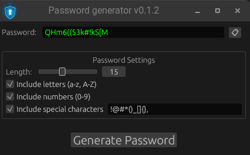

# Password Generator

[](https://github.com/denix666/password-generator)
[](https://github.com/denix666/password-generator/releases)
[](https://opensource.org/licenses/MIT)

A secure, user-friendly password generator built with Rust and eframe. Generate strong passwords with customizable options for enhanced security.

## Features

✅ **Customizable Password Generation**
- Control password length (4-32 characters)
- Include or exclude letters (a-z, A-Z)
- Include or exclude numbers (0-9)
- Include or exclude special characters (Define characters, that you want to include in generation)

✅ **User-Friendly Interface**
- Clean, intuitive design
- Real-time password display
- Simple copy-to-clipboard functionality
- Visual feedback for user actions

✅ **Security First**
- Cryptographically secure random number generation
- No password storage or transmission
- Local execution only

## Screenshots



## Getting Started

### Prerequisites

- [Rust](https://www.rust-lang.org/tools/install) (1.91 or later)
- Cargo (comes with Rust)

### Installation

1. Clone the repository:
   ```sh
   git clone https://github.com/denix666/password-generator.git
   cd password-generator
   ```

2. Build the project:
   ```sh
   cargo build --release
   ```

3. Run the application:
   ```sh
   cargo run --release
   ```

## Usage

1. Adjust the password length using the slider
2. Select character types using checkboxes:
   - Letters (a-z, A-Z)
   - Numbers (0-9)
   - Special characters
3. Click "Generate Password"
4. Click the clipboard icon to copy the password

## Default Settings

- Password length: 12 characters
- All character types enabled (letters, numbers, and special characters)

## Dependencies

- [eframe](https://github.com/emilk/egui/tree/master/eframe) (0.33.2) - Rust GUI framework
- [rand](https://github.com/rust-random/rand) (0.9) - Random number generation
- [arboard](https://github.com/1Password/arboard) (3) - Clipboard operations
- [image](https://github.com/image-rs/image) (0.25) - Image processing

## Building for Different Platforms

### Linux
```sh
cargo build --release
```

### Windows
```sh
cargo build --release
```

### macOS
```sh
cargo build --release
```

## Contributing

Contributions are welcome! Please feel free to submit a Pull Request.

1. Fork the repository
2. Create your feature branch: `git checkout -b feature/amazing-feature`
3. Commit your changes: `git commit -m 'Add some amazing feature'`
4. Push to the branch: `git push origin feature/amazing-feature`
5. Open a Pull Request

## License

This project is licensed under the MIT License - see the LICENSE file for details.

## Acknowledgments

- [egui](https://github.com/emilk/egui) for the excellent UI framework
- [Rust community](https://www.rust-lang.org/community) for their invaluable resources
